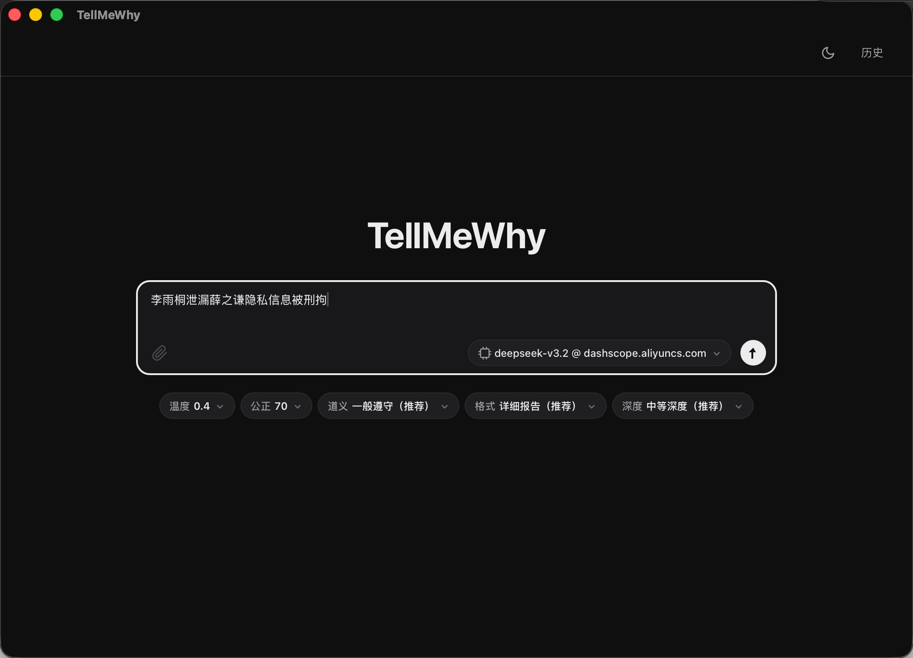
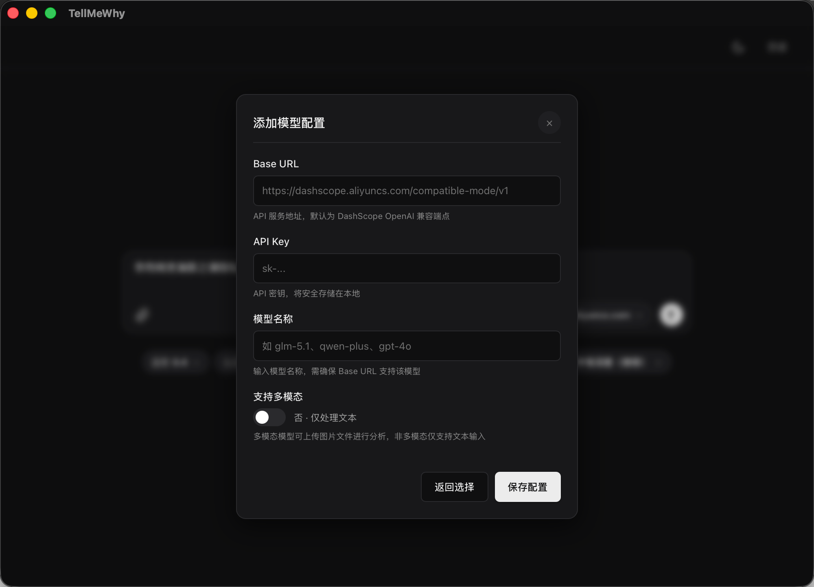
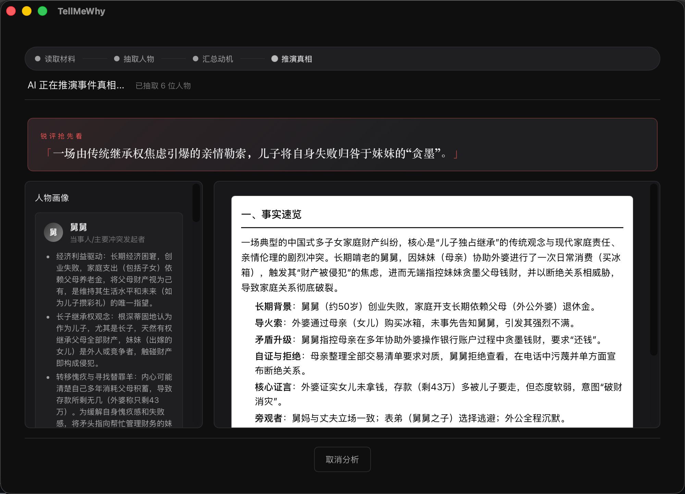
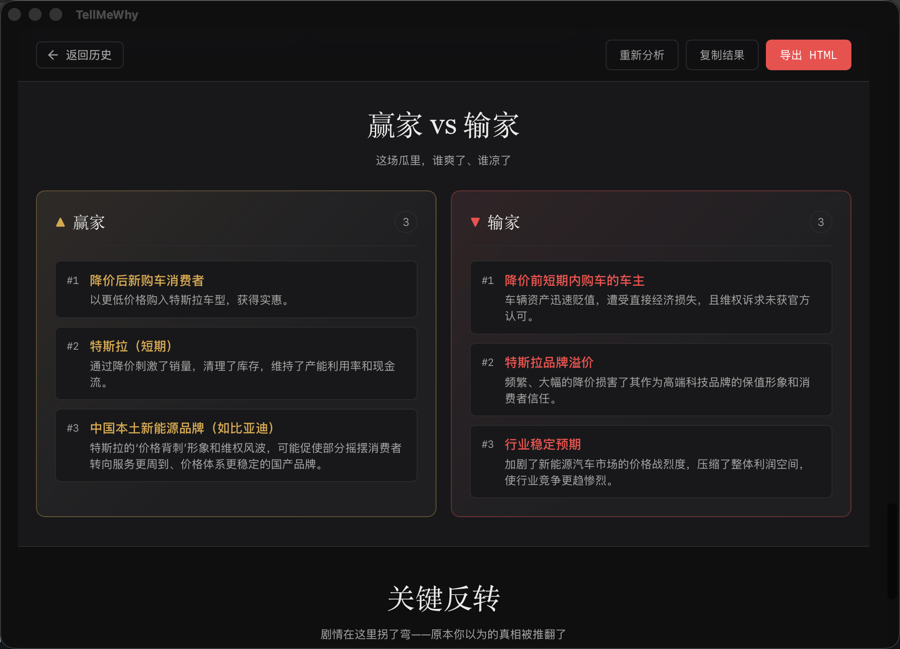
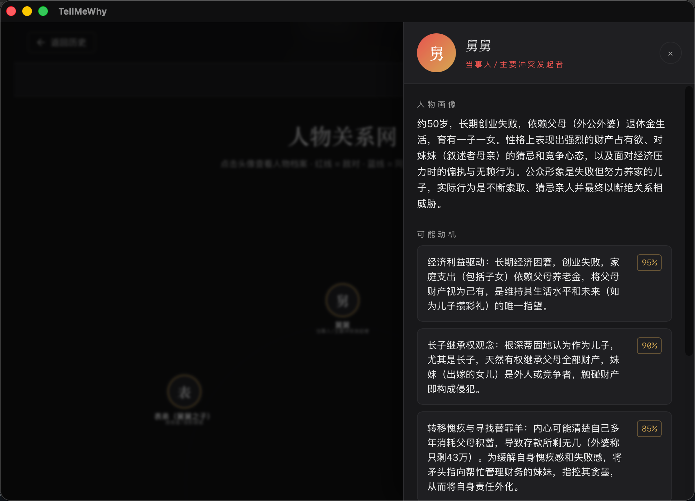
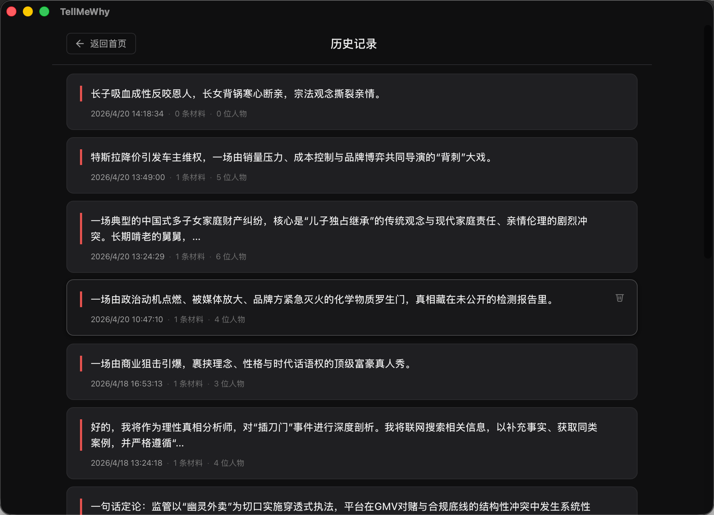

# TellMeWhy

基于大语言模型的**真相推测 / 事件分析**桌面应用。你可以汇总文字、图片等材料，配置分析风格与参数，由模型流式输出推理过程与结构化结果，并支持历史记录与导出。

|     |                                                                 |
| --- | --------------------------------------------------------------- |
| 界面 | [Svelte 5](https://svelte.dev/) + [Vite](https://vitejs.dev/) + [Tailwind CSS](https://tailwindcss.com/) |
| 桌面 | [Tauri 2](https://v2.tauri.app/)（Rust）                          |

## 功能概览

- **多源材料**：支持纯文本、本地文件；图片可走多模态模型理解内容。
- **分析配置**：可调温度、叙事风格、公正与道德边界等参数（以应用内选项为准）。
- **流式体验**：分析阶段与模型输出实时展示，避免长时间黑盒等待。
- **人物与动机**：从材料中抽取人物画像，并参与后续推演（流程以当前版本 UI 为准）。
- **历史记录**：本地保存过往会话，可回看。
- **系统托盘**：常驻托盘图标，便于唤起或退出。
- **模型配置**：支持 **OpenAI 兼容 API**（自定义 Base URL、API Key、模型名、多模态开关等），配置保存在本机。

> **说明**：你需要自行准备可用的 LLM API（及网络环境）。本应用仅在本地存储密钥与偏好，不向开发者服务器上传材料内容。

## 项目截图

<table>
  <tr>
    <td></td>
    <td></td>
    <td></td>
  </tr>
  <tr>
    <td></td>
    <td></td>
    <td></td>
  </tr>
</table>

## 运行方式说明

当前版本仅提供 **源码运行**，不提供安装包下载。

- 如果你只是普通用户，当前仓库不支持“下载即用”。
- 如果你可以接受本地开发环境，按下方步骤可在 macOS / Windows / Linux 运行。

## 开发环境要求（源码运行）

开始前请安装：

- [Node.js](https://nodejs.org/)（建议当前 LTS）
- [pnpm](https://pnpm.io/)（本项目脚本使用 pnpm）
- [Rust](https://www.rust-lang.org/tools/install)（仅桌面模式需要）
- 各操作系统下 Tauri 所需系统依赖（仅桌面模式需要，见 [Tauri 前置条件](https://v2.tauri.app/start/prerequisites/)）

## 快速开始（跨平台）

```bash
# 1) 克隆仓库
git clone <YOUR_REPO_URL>
cd tellMeWhy

# 2) 启用 pnpm（推荐）
corepack enable
corepack prepare pnpm@latest --activate

# 3) 安装依赖
pnpm install

# 4A) 仅启动前端页面（最快）
pnpm dev

# 4B) 启动桌面模式（Vite + Tauri）
pnpm tauri:dev
```

首次运行请在应用内完成 **模型 / API** 相关设置，否则无法调用大模型。

## 两种启动方式（重点）

- **前端页面模式（推荐先跑通）**：执行 `pnpm dev`。  
  只需要 Node.js + pnpm，可快速验证 UI 与基础交互，不依赖 Rust。
- **桌面能力模式（完整功能）**：执行 `pnpm tauri:dev`。  
  需要 Node.js + pnpm + Rust + Tauri 系统依赖，可使用托盘、原生能力与本地桌面集成。

## 常见问题

- **需要安装 Rust 吗？**  
  如果只跑前端页面（`pnpm dev`），不需要。  
  如果要跑桌面模式（`pnpm tauri:dev`），需要 Rust。
- **`pnpm tauri:dev` 启动失败怎么办？**  
  先检查 Rust、Node.js、pnpm 版本与 Tauri 系统依赖是否完整，再重试。
- **能只运行前端吗？**  
  可以，直接执行 `pnpm dev`。这是最轻量的启动方式。

## 仓库结构（简要）

```
tellMeWhy/
├── src/                 # 前端（Svelte）
├── src-tauri/           # Tauri 后端（Rust）
│   ├── src/lib.rs       # 命令、流式请求、存储等
│   └── tauri.conf.json  # 应用元数据与打包配置
├── package.json
└── README.md
```

## 安全与隐私

- 前端对渲染内容使用 **DOMPurify** 等做 HTML 净化，降低 XSS 风险。
- API Key 等敏感配置通过 Tauri Store **保存在用户本机**，请妥善保管设备与备份策略。

## 许可证

本项目基于 [MIT License](./LICENSE) 开源。

## 社区

<p align="left">
    <a href="https://linux.do" alt="LINUX DO">
        </a>
</p>

